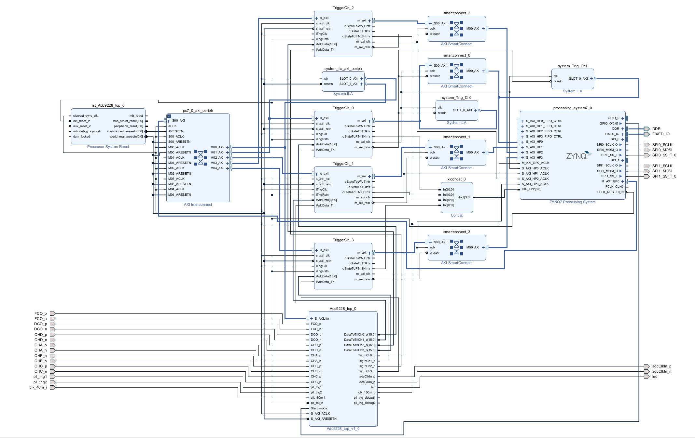

# ZYNQ_SARSystem
利用ZYNQ7020实现SAR数据采集系统，其中包含硬件设计代码、上位机、测试程序。

# 版本
vivado 2017.4

# 文件说明
Adc9228_TCP_System_v3：系统工程

Adc9228_top_axi_v2：前端处理模块，传输四路Adc9228采集数据

TriggerCh：数据写ddr模块

matlab程序：对修改前测量数据测距，测试性能使用

ZynqTCP_Concurrent_v1：网口+串口上位机

# 系统结构

# 上位机

# 采集测试
