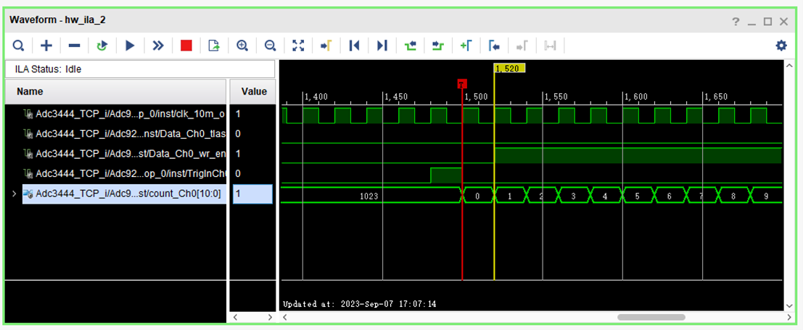
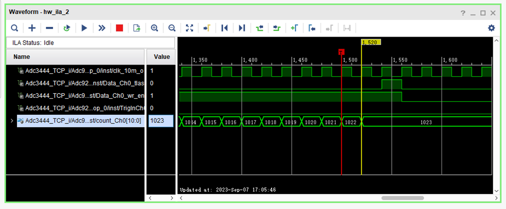
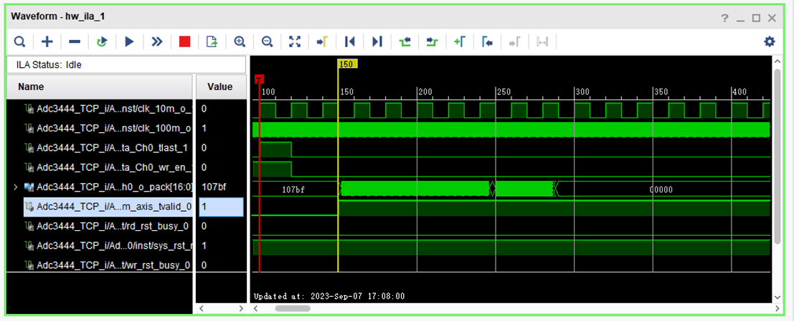
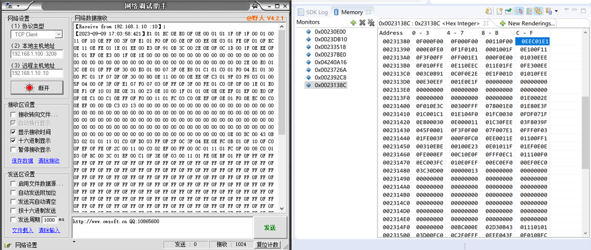
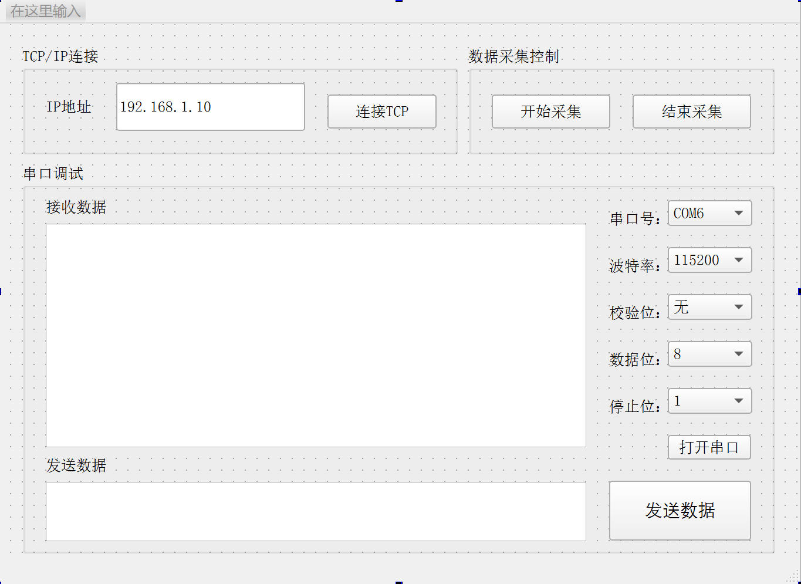

# ZYNQ_SARSystem
通过ZYNQ 7020实现了SAR雷达信号采集系统，主要模块分为：雷达射频接收模块、数据存储模块、（PS）配置和TCP传输模块。

①	雷达射频接收模块：四路12bit的AD9228模块采集回波数据，并在数据存储模块中实现回波信号的采集、差分信号的串并转换，由60MHz转换至10MHz时钟域，然后用异步FIFO转换至100MHz（把数据和有效信号合并传输确保数据稳定采集），每次整合一个16bit就输出并输出有效脉冲。

②	数据存储模块TriggerCh：输入信号完成DDR写入，写好1024 Byte输出指示脉冲作为PS中断信号，后续PS响应中断则执行数据TCP发送。

③	（PS）配置和TCP传输模块：接收到中断后通过LWIP编写TCP网口发数给上位机，将数据加上包头，1包发送1024 Byte。选用PLL lmx2491，通过构造发射波形，通过SPI配置PLL构造斜波发射信号。

# 开发环境
Vivado 2017.4

# 系统结构

Adc9228_TCP_System_v3：系统工程

Adc9228_top_axi_v2：前端处理模块，传输四路Adc9228采集数据

TriggerCh：数据写ddr模块

matlab程序：对修改前测量数据测距，测试性能使用

ZynqTCP_Concurrent_v1：网口+串口上位机

# 测试结果
Adc9228_top测试结果：

测试写入和TCP发送：

写入成功，基地址开始有无效数据，有效数据的开始计算为：DmaBasePtr + RingPtr，长度1024。

写入完成通过TCP发送结果准确无误。（添加不同包头以区分四路采集数据）

上位机界面：

